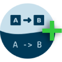

#  Mermaid Diagrams+

A enhanced Google Docs add-on for creating beautiful diagrams using Mermaid syntax. This project is a fork
of [mermaid-gdocs](https://github.com/renanlecaro/mermaid-gdocs/) with an improved code editor interface for a more
seamless diagramming experience.

## Features

- All the powerful features of the original Mermaid for Google Docs
- Enhanced code editor for better syntax highlighting and editing experience
- Streamlined interface for improved usability

## Installation

[Add to Google Docs](https://gsuite.google.com/marketplace/app/mermaid_diagrams_plus/YOUR_APP_ID)

## Privacy & License

This project is licensed under the [MIT License](LICENSE.md). For information about how we handle your data, please see
our [Privacy Policy](PRIVACY_POLICY.md).

## Credits

Based on the original [Mermaid for Google Docs](https://github.com/renanlecaro/mermaid-gdocs/) by Renan Le Caro.