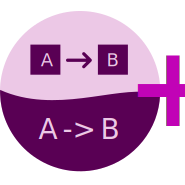

A Google Docs and Slides add-on that enables you to create and edit diagrams directly in your documents using the
Mermaid syntax. This tool allows you to generate flowcharts, sequence diagrams, gantt charts, and more - all within
your Google Docs and Google Slides documents.



## What This App Does

Mermaid Diagrams+ enhances your Google Docs and Slides with:

- Creation of diagrams using simple text-based syntax
- Live preview of your diagrams as you type
- Direct integration with Google Docs and Slides
- Export of diagrams as images in your documents
- Enhanced code editor with syntax highlighting
- Multiple diagram types support (flowcharts, sequence diagrams, gantt charts, etc.)

## Data Usage & Permissions

This add-on:

- Only accesses the content of documents you explicitly use it in
- Requires document edit permissions to insert diagrams
- Does not store any of your document content
- Does not collect personal information beyond basic usage statistics

## Privacy & Security

We take your privacy seriously. For detailed information about how we handle your data:

- Read our [Privacy Policy](PRIVACY_POLICY.md)
- Review our [MIT License](LICENSE.md)
- [Terms of use](TOS.md)

## Support & Contact

If you need help or have questions about Mermaid Diagrams+, please:

- Visit our [GitHub repository](https://github.com/AlmogBaku/mermaid-gdocs-plus/) for technical documentation
- Create an [issue on GitHub](https://github.com/AlmogBaku/mermaid-gdocs-plus/issues) for bug reports or feature
  requests
- For general inquiries, or to report security vulnerabilities - [email us](mailto:almog.baku+mermaid-plus@gmail.com).

## Credits

This is an enhanced fork of the original [Mermaid for Google Docs](https://github.com/renanlecaro/mermaid-gdocs/) by
Renan Le Caro. Our version adds an improved code editor and enhanced user interface while maintaining all the powerful
features of the original.